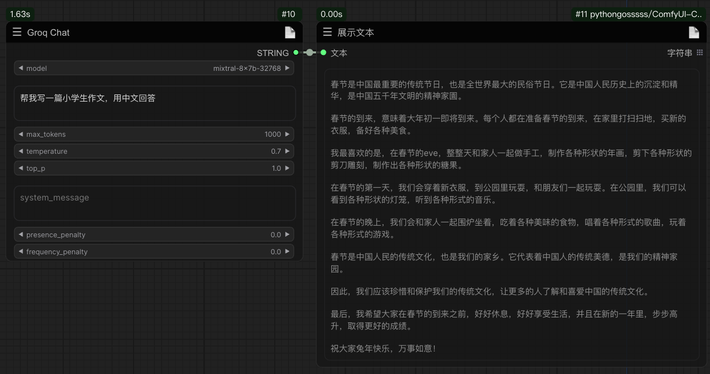

# comfy-graqchat
Content generation with open source models in comfyui via graq api implementation.

# Usage:
The following four models are currently supported.
* gemma-7b-it
* llama3-70b-8192
* mixtral-8x7b-32768
* llama3-8b-8192

The API was requested through https://console.groq.com/keys, which had not launched a paid plan as of the time of publication. 
However, there are corresponding restrictions, as shown below:

____
## Example:

____
##Statement：
The GroqChat node follows the MIT license agreement, and some of the functional code comes from other open source projects. Thanks to the original authors. For commercial use, please refer to the original project license agreement for authorization.

