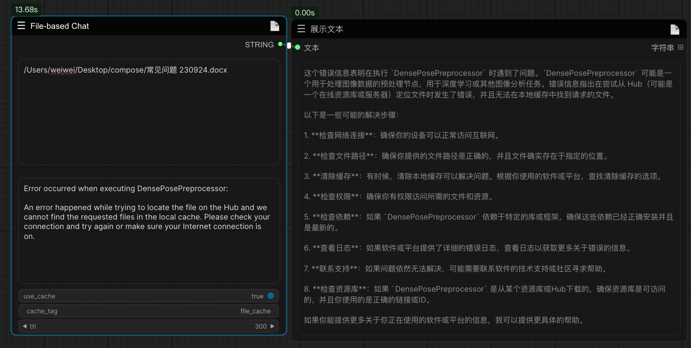
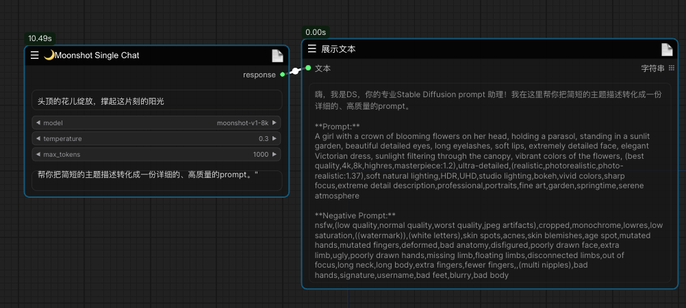
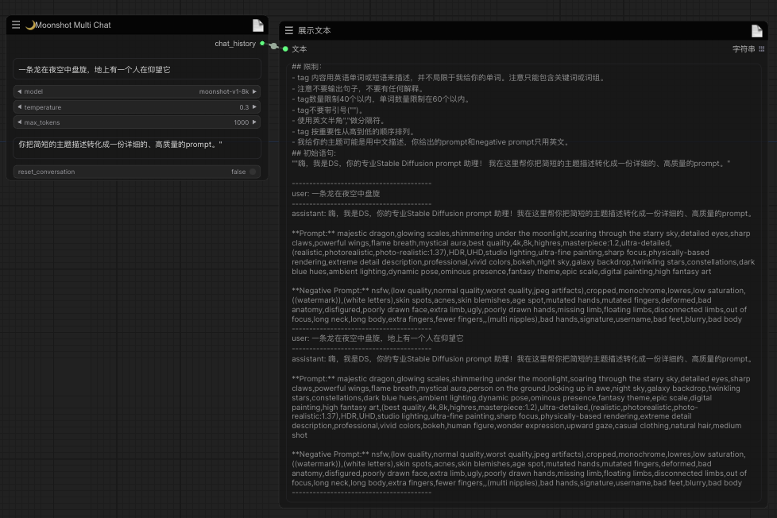
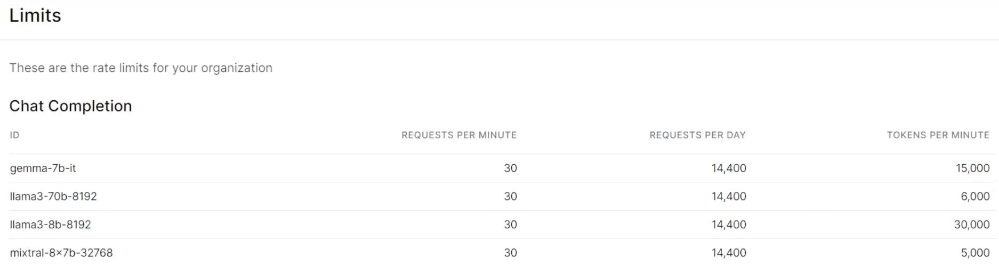
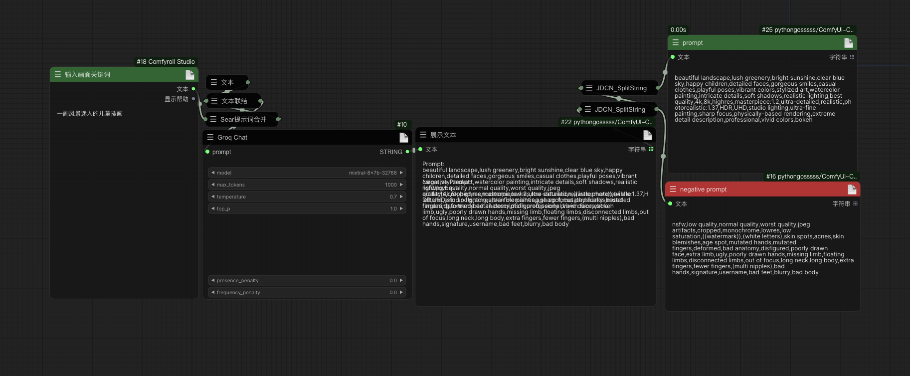

# comfy-groqchat
Updated image backpropagation nodes based on Google's open-source PaliGemma vision model. The model used in the node is a fine-tuned version of gokayfem's big brother, special thanks for that! Content generation with open source models in comfyui via graq api implementation.

# Usage:
2024-07-14
新增了SD3LongCaptionerV2这个图像反推节点的模型加载和存储目录，考虑到模型偏大的问题，可以手动从huggingface上下载模型放到ComfyUl/models/LLavacheckpoints/files_for_sd3_long_captioner_v2这个目录下，模型地址https://huggingface.co/gokaygokay/sd3-long-captioner-v2

再次更新了基于kimi API的文件对话功能的file_based_chat节点，能实现低配的知识库功能，上传文件格式支持pdf、doc、xlsx、ppt、txt、图片等。具体应用示例，可以上传知识库中的”常见报错问题(文档可在库中获得，来源K佬)”，来解决部分报错问题

新更新了对 kimi api的支持，包括“Moonshot Single Chat”和“Moonshot Multi Chat”两个节点，分别支持单轮或多轮对话。API申请地址 https://platform.moonshot.cn/console/info
单轮对话，如下所示：

多轮对话：

Groq nodes are based on the groq cloud API.The following four models are currently supported.
* gemma-7b-it
* llama3-70b-8192
* mixtral-8x7b-32768
* llama3-8b-8192

The API was requested through https://console.groq.com/keys, which had not launched a paid plan as of the time of publication. Fill the api key into the "config.json" file.
However, there are corresponding restrictions, as shown below:

____
## Example:

The use of nodes enables the generation of positive and negative cues in 2 seconds through specific cues.

Picture with workflow
____
##Statement：
The GroqChat node follows the MIT license agreement, and some of the functional code comes from other open source projects. Thanks to the original authors. For commercial use, please refer to the original project license agreement for authorization.Thanks also to Google's open source PaliGemma model.

