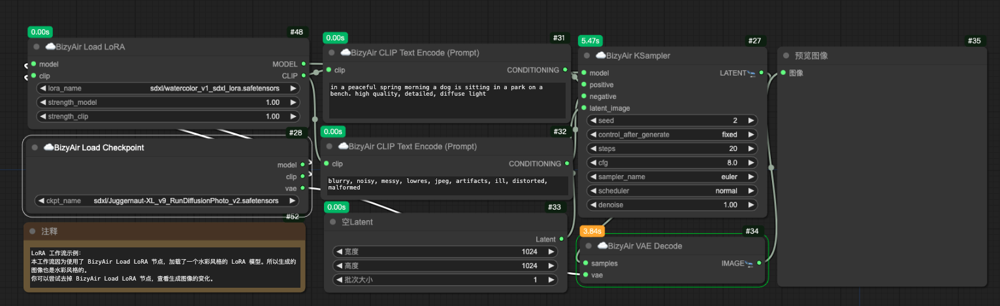
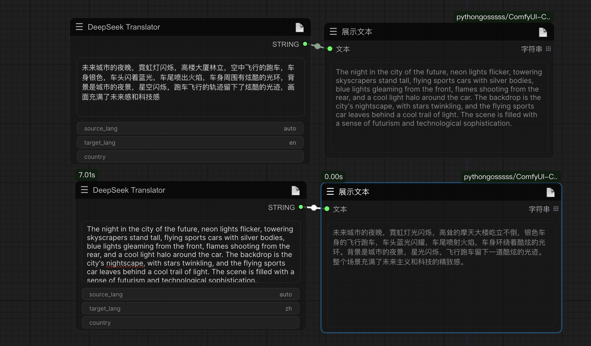
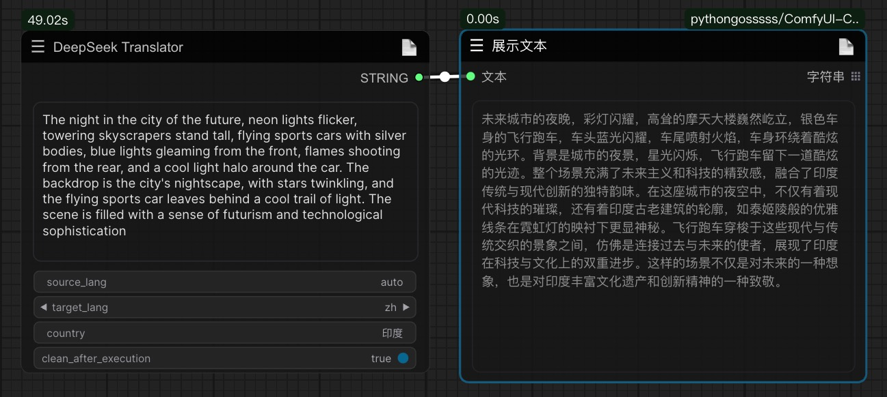
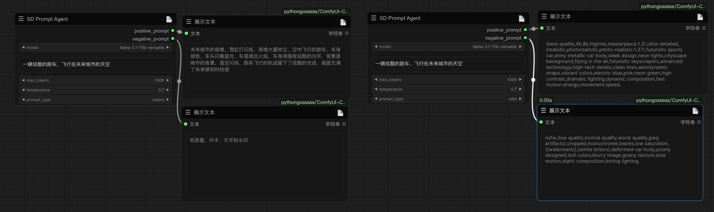
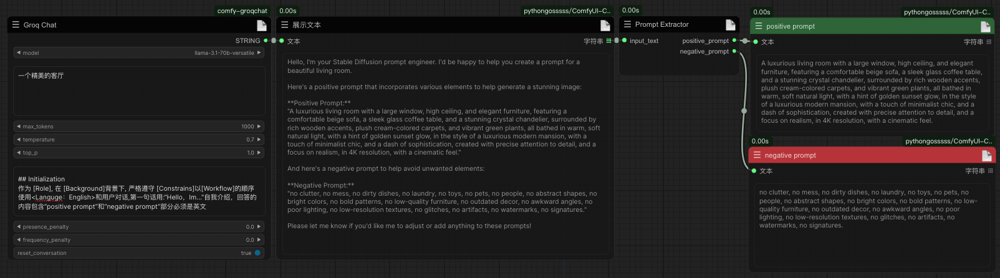

# comfy-groqchat
The dialogue functionality of the current node is based on the Groq API (https://console.groq.com/keys), kimi API (https://platform.moonshot.cn/console/api-keys), and deepseek API (https://platform.deepseek.com/api_keys). Please obtain the necessary API keys from the respective websites and place them in the api_key.ini file. Through API calls, single-turn or multi-turn chats can be achieved to generate positive and negative prompts and error guides. Additionally, the node integrates image inversion nodes based on the moondream2 and PaliGemma large models.
<details>
What the parameters presence_penalty and frequency_penalty do: `presence_penalty` and `frequency_penalty` are parameters used to control the diversity and repetition of the output of the language model. Let me explain what they do in more detail.          

1. presence_penalty（存在惩罚）:
   - The range is typically -2.0 to 2.0.
   - This parameter is used to penalize new tokens based on whether they already appear in the text.
   - Positive values increase the likelihood that the model will talk about new topics.
   - Negative values make the model more inclined to repeat what has already been said.
   - A value of 0 has no effect.

2. frequency_penalty（频率惩罚）:
   - The range is also typically -2.0 to 2.0.
   - This parameter penalizes new tokens based on how often they have appeared in the text so far.
   - Positive values reduce the likelihood that the model will repeat the same phrase verbatim.
   - Negative values encourage the model to repeat commonly used words.
   - A value of 0 has no effect.

The main difference between these two parameters:
- `presence_penalty` Only cares if a token has appeared, regardless of how many times it has appeared.
- `frequency_penalty` Then the number of occurrences of a token is taken into account, and the more occurrences, the greater the penalty.

Example of use:
1. If you want the model to produce more diverse content, you can set higher positive values, for example:
   ```python
   presence_penalty=0.6, frequency_penalty=0.8
   ```

2. If you want the model to be more focused on a specific topic, you can use a lower value or a slightly negative value, for example:
   ```python
   presence_penalty=0, frequency_penalty=-0.2
   ```

3. For most general purposes, keeping these two values at or near 0 usually works well:
   ```python
   presence_penalty=0, frequency_penalty=0
   ```
Also in the groqchat.py node, temperature and top_p are two important parameters used to control the randomness and diversity of the language model output.

1. temperature（温度）:
   - The range is usually 0 to 2.0 and the default value is usually 0.7.
   - Controls the randomness of the output.
   - Lower values (closer to 0) result in a more deterministic and consistent output, with the model being more inclined to choose the most likely next word.
   - Higher values will increase randomness and make the output more diverse and creative, but may also introduce more irrelevant or incoherent content.
   - When temperature is 0, the model always chooses the most likely next word and the result becomes completely deterministic.

2. top_p（核采样）:
   - The range is 0 to 1.0 and the default value is usually 1.0.
   - This is an alternative sampling method known as "nuclear sampling".
   - top_p controls the cumulative probability threshold of the words considered by the model.
   - For example, if top_p is set to 0.9, the model will only consider the most likely words with a cumulative probability of 90%.
   - Lower values result in a more focused and deterministic output, while higher values allow for more variety.

Suggestions for the use of these two parameters:

1. For tasks that require a high degree of consistency and accuracy (e.g., quizzing or fact generation), use a lower temperature (e.g., 0.3-0.5) or a lower top_p value.

2. For creative writing or tasks requiring more variety, use a higher temperature (e.g., 0.7-1.0) or a top_p value close to 1.

3. Instead of tuning both parameters at the same time, one is usually chosen for tuning. temperature is more commonly used, while top_p may be more effective in some specific scenarios.

4. In practice, the optimal values of these parameters often need to be determined experimentally, as their effects may vary depending on the task and the type of output required.

In the groqchat.py node, these two parameters allow the user to tailor the characterization of the model output to specific needs, thus finding the right balance between consistency and creativity.
And in practice, the optimal values of these parameters often need to be determined experimentally, as their effectiveness may vary depending on the task and the type of output required. For Groq's API, you may need to check its documentation to confirm that these parameters work exactly as described above, as different AI service providers may have subtle implementation differences.
<summary>Parameter details</summary>
</details> 

# Usage:
2024-08-04  
Add gemma2 related node, please manually download the model to ComfyUI/models/LLavacheckpoints/gemma-2-2b-it, model address https://huggingface.co/google/gemma-2-2b-it/tree/main
2024-08-02
Added a feature to dynamically display node computation time, which can be turned off in the settings. (Inspired by ty0x2333's ComfyUI-Dev-Utils for time display code, thanks to the author)
 
2024-08-01  
Added the deepseek chat node, which supports not only regular conversations but also includes five built-in roles: "Error Assistant," "Clickbait Generator," "Inspiration Helper," "Xiaohongshu Style," and "Information Extractor."
  
2024-07-29  
A new personalized translation node based on the deepseek API has been added, which, combined with the Agentic workflow process of big brother Wu Enda, shows excellent translation standards. See the example below for specific usage: 
  
Setting the country parameter to polish the translation results
  
2024-07-28  
Added two new prompt direct-out nodes that can directly expand the input theme into a prompt word that matches SD or kolors.

A new cue word separation node has been added to separate positive and negative cues in the text based on regular matching

2024-07-27  
In the groqchat node, a new reset conversation parameter has been added, the value of which is True to enable the single-round conversation function; a new prompt_extractor.py node has been added to separate the positive and negative prompt words in the text. 

2024-07-24  
1. node based on groq API, added support for llama3.1 model.
2. Optimize the classification of all nodes, add the image backpropagation node dwimage2.py for moondream2, the model supports manual download to . /ComfyUI/models/LLavacheckpoints/files_for_moondream2 directory (all files are put under this folder). Model address: https://huggingface.co/vikhyatk/moondream2/tree/main

2024-07-14  
Added SD3LongCaptionerV2, a model loading and storing directory for the image inversion node. Considering the problem of large model, you can manually download the model from huggingface and put it into ComfyUl/models/LLavacheckpoints/files_for_sd3_long_captioner_v2 directory. Captioner_v2 directory, the model address https://huggingface.co/gokaygokay/sd3-long-captioner-v2

Once again updated file_based_chat node based on kimi API file conversation function, can realize the knowledge base function of the low-cost, upload file format support pdf, doc, xlsx, ppt, txt, pictures and so on. Specific application examples, you can upload the knowledge base in the "common error problems (documents can be obtained in the library, the source of K guy)", to solve some of the error problems.

Newly updated support for kimi api, including "Moonshot Single Chat" and "Moonshot Multi Chat" nodes, which support single round or multiple rounds of conversation respectively.API application address https://platform.moonshot.cn/console/info
A single round of dialog, as shown below:

Multiple rounds of dialog:


Groq nodes are based on the groq cloud API.The following four models are currently supported.
* gemma-7b-it
* llama3-70b-8192
* mixtral-8x7b-32768
* llama3-8b-8192

The API was requested through https://console.groq.com/keys, which had not launched a paid plan as of the time of publication. 
However, there are corresponding restrictions, as shown below:

____
## Example:

The use of nodes enables the generation of positive and negative cues in 2 seconds through specific cues.

Picture with workflow
____
##Statement：
The GroqChat node follows the MIT license agreement, and some of the functional code comes from other open source projects. Thanks to the original authors. For commercial use, please refer to the original project license agreement for authorization.Thanks also to Google's open source PaliGemma model.

